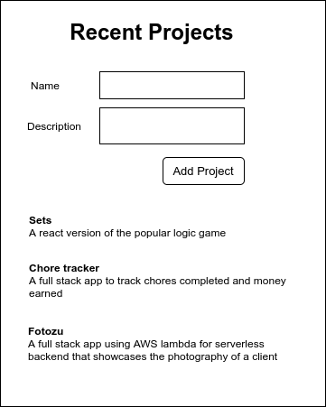
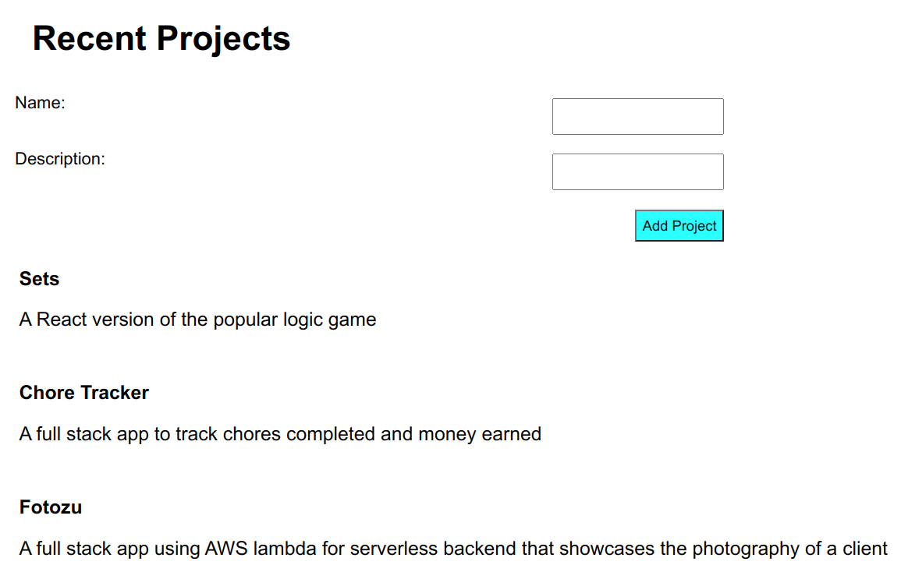

# React Hooks (Project List)
The below was a lesson on React Hooks in which I refactored the provided code in a simple app (Project List) to use the `useState` and `useEffect` hooks so as to implement state and lifecycle management with functional components.

This project is used in the React hooks lesson. It is a simple app with a form and a list of things that have been created. In this case, we are displaying recent projects:

To use this project:
1. Clone this repository
2. Run yarn install to install dependencies
3. Run yarn start to start application

You should see something like this:

